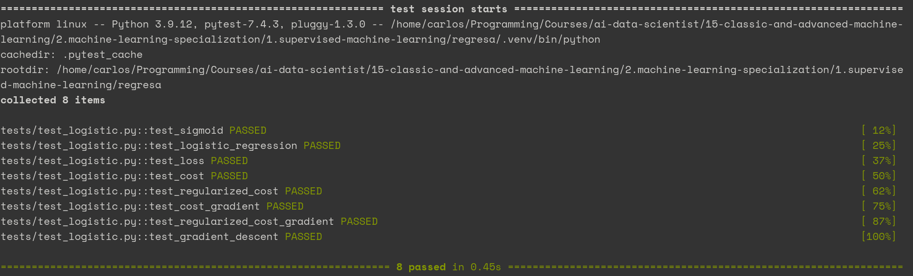

# Regresa

**Regresa** is a Python package where I implemented my own versions of the algorithms presented by [Andrew Ng](https://www.andrewng.org) in his [Supervised Machine Learning: Regression and Classification](https://www.coursera.org/learn/machine-learning?specialization=machine-learning-introduction) course.

My motivations were:

1. to have clear and reusable implementation of the algorithms for learning purposes,
2. to add tests to the implementations, so I could play refactoring them.

## Installation

**Regresa** have been implemented using [Poetry](https://python-poetry.org), what means this instructions should be sufficient for you to install it.

```bash
git clone https://github.com/elcapo/regresa.git
cd regresa
poetry install
```

> Note that you'll need to install **git**, **python** and **poetry** to get this working.

## Usage

Once installed, use **Poetry**'s shell to interact with the package.

```bash
poetry shell
```

### Getting Help

The **logistic** module offers the functions `sigmoid`, `apply_regression`, `loss`, `cost`, `cost_gradient` and `gradient_descent`. All of them offer some kind of information that can be queried using Python's **help** function.

```python
from regresa.logistic import *
help(sigmoid)
```

## Tests

To run the tests, use **PyTest** from your shell.

```bash
pytest -v
```

