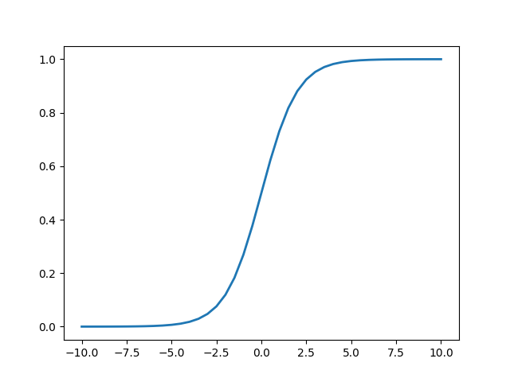
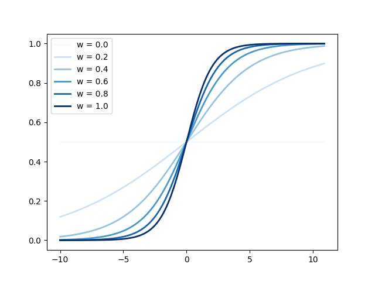
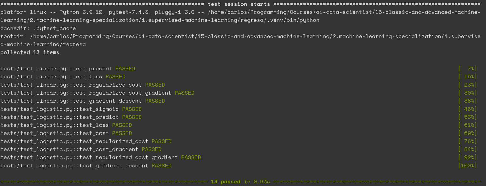

# Regresa

**Regresa** is a Python package where I implemented my own versions of the linear and logistic regression algorithms presented by [Andrew Ng](https://www.andrewng.org) in his course: [Supervised Machine Learning: Regression and Classification](https://www.coursera.org/learn/machine-learning?specialization=machine-learning-introduction).

My motivations were:

1. to have reusable implementation of the algorithms for learning purposes,
2. to write the algorithms avoiding nested loops for readability,
3. to add tests to the implementations so I could play refactoring them.

## Installation

**Regresa** is written with [Poetry](https://python-poetry.org). The following instructions should be sufficient for you to start using it.

```bash
git clone https://github.com/elcapo/regresa.git
cd regresa
poetry install
```

> Note that you'll need to install **git**, **python** and **poetry** to get this working.

## Usage

Once installed, use **Poetry**'s shell to interact with the package.

```bash
poetry shell
```

### Linear

The **linear** module offers functions to compute a linear regression given a set of examples with one or more features:

- [predict](#linear--predict): apply a given set of coefficients to the input to predict an output
- [loss](#linear--loss): compute the individual loss for a set of examples
- [cost](#linear--cost): compute the total cost for a set of examples
- [cost_gradient](#linear--cost-gradient): compute the gradient of the cost of a given set of coefficients
- [gradient_descent](#linear--gradient-descent): compute a gradient descent

These functions can be imported one by one:

```python
from regresa.linear import predict

# ... and then use them directly by their names
predict([[0], [1]], [2], .5) # [0.5, 2.5]
```

... or all at once:

```python
from regresa import linear

# ... and then use them directly by their names prefixed with linear
linear.predict([[0], [1]], [2], .5) # [0.5, 2.5]
```

#### Linear / Predict

```python
from regresa.linear import predict

help(predict)
```

```

    Apply a given set of coefficients to the input to predict an output.

    Arguments:
        X (ndarray (m, n)): input values where the regression will be computed
        w (ndarray (n, )): weights for each of the features
        b (scalar): biased weight for the regression

    Return:
        f_wb (ndarray (m, )): evaluation of the linear regression for each value of x
    
```

The linear function is given by the expression:

```math
f_{\vec{w}, b}(\vec{x}) = \vec{w}·\vec{x} + b
```

#### Linear / Loss

```python
from regresa.linear import loss

help(loss)
```

```

    Compute the loss of a set of examples.

    Arguments:
        X (ndarray (m, n)): input values where the regression will be computed
        y (ndarray (m, )): vector with boolean tags for each example
        w (ndarray (n, )): weights for each of the features
        b (scalar): biased weight for the regression

    Returns:
        (ndarray (m, )): loss for each of the given examples
    
```

```math
j^{[i]} = \sum_{i=1}^{m}(f_{\vec{w},b}(\vec{x}^{[i]}) - y^{[i]})^2
```

#### Linear / Cost

```python
from regresa.linear import cost

help(cost)
```

```

    Compute the cost for a given set of examples.

    Arguments:
        X (ndarray (m, n)): input values where the regression will be computed
        y (ndarray (m, )): vector with boolean tags for each example
        w (ndarray (n, )): weights for each of the features
        b (scalar): biased weight for the regression
        lambde (scalar): factor of regularization

    Returns:
        (scalar): total cost for the given set of weights
    
```

```math
J(\vec{w}, b) = \frac{1}{m} \sum_{i=1}^{m} j^{[i]} - \frac{\lambda}{2m} \vec{w} \cdot \vec{w}
```

#### Linear / Cost Gradient

```python
from regresa.linear import cost_gradient

help(cost_gradient)
```

```

    Compute the gradient of the cost for a given set of examples.

    Arguments:
        X (ndarray (m, n)): input values where the regression will be computed
        y (ndarray (m, )): vector with boolean tags for each example
        w (ndarray (n, )): weights for each of the features
        b (scalar): biased weight for the regression
        lambde (scalar): factor of regularization

    Returns:
        (ndarray (n, )): gradient of the cost for the given set of weights w
        (scalar): gradient of the cost for the given weight b
    
```

#### Linear / Gradient Descent

```python
from regresa.linear import gradient_descent

help(gradient_descent)
```

```

    Compute a gradient descent.

    Arguments:
        X (ndarray (m, n)): input values where the regression will be computed
        y (ndarray (m, )): vector with boolean tags for each example
        w (ndarray (n, )): weights for each of the features
        b (scalar): biased weight for the regression
        alpha (scalar): learning rate
        iterations (scalar): number of iterations to run

    Returns:
        (ndarray (n, )): weights for each feature after the iterations
        (scalar): additional scalar weight
    
```

### Logistic

The **logistic** module offers functions to compute a binary classification given a set of examples with one or more features:

- [sigmoid](#logistic--sigmoid): compute the sigmoid of a vector
- [predict](#logistic--predict): apply a given set of coefficients to the input to predict an output
- [loss](#logistic--loss): compute the individual loss for a set of examples
- [cost](#logistic--cost): compute the total cost for a set of examples
- [cost_gradient](#logistic--cost-gradient): compute the gradient of the cost of a given set of coefficients
- [gradient_descent](#logistic--gradient-descent): compute a gradient descent

These functions can be imported one by one:

```python
from regresa.logistic import sigmoid

# ... and then use them directly by their names
sigmoid(.5) # .6224593312018546
```

... or all at once:

```python
from regresa import logistic

# ... and then use them directly by their names prefixed with logistic
logistic.sigmoid(.5) # .6224593312018546
```

#### Logistic / Sigmoid

```python
from regresa.logistic import sigmoid

help(sigmoid)
```

```

    Compute the sigmoid of z. In other words, compute 1 / (1 + e**(-z)).

    Arguments:
        z (ndarray (m, )): one dimensional vector with the input values

    Returns:
        (ndarray (m, )): vector with the dimension of z and the result of the computation
    
```

The sigmoid function is determined by the expression:

```math
\frac{1}{1 + e^{-z}}
```

This function accepts scalars as input. If a scalar is given, a scalar is also returned.

```python
sigmoid(0) # 0.5
sigmoid(9**9) # 1.0
```

The function also accepts lists of numbers and Numpy arrays as input. In those cases, a Numpy array with the same dimension of the input is returned.

```python
sigmoid([0, 9**9]) # array([0.5, 1. ])
```

In combination with the `plot` method from the `plotter` module, you can easily have a glimpse on how the function looks like.

```python
from regresa.logistic import sigmoid
from regresa.plotter import plot

x = [x for x in range(-10, 10 + 1)]
y = sigmoid(x)

plot(x, y)
```



#### Logistic / Predict

```python
from regresa.logistic import predict

help(predict)
```

```

    Apply a given set of coefficients to the input to predict an output.

    Arguments:
        X (ndarray (m, n)): input values where the regression will be computed
        w (ndarray (n, )): weights for each of the features
        b (scalar): biased weight for the regression

    Return:
        f_wb (ndarray (m, )): evaluation of the logistic regression for each value of x
    
```

In combination with the `plot` method from the `plotter` module, you can check how a logistic regression graph changes with different weights.

```python
from regresa import plotter, logistic

x = [[x/10] for x in range(-100, 110, 1)]
multiple_y = [logistic.predict(x, [d/10], 0) for d in range(0, 12, 2)]
labels = ['w = {}'.format(d/10) for d in range(0, 12, 2)]

plotter.over_plot(x, multiple_y, legends)
```




#### Logistic / Loss

```python
from regresa.logistic import loss

help(loss)
```

```

    Compute the loss of a set of examples.

    Arguments:
        X (ndarray (m, n)): input values where the regression will be computed
        y (ndarray (m, )): vector with boolean tags for each example
        w (ndarray (n, )): weights for each of the features
        b (scalar): biased weight for the regression

    Returns:
        (ndarray (m, )): loss for each of the given examples
    
```

The loss function is a convenience that helps us debugging the cost function, as its the part of the cost that corresponds to each example. It's given by:

```math
j^{[i]} = -y^{[i]} log(f_{\vec{w},b}(\vec{x}^{[i]})) - (1 - y^{[i]}) log(1 - f_{\vec{w},b}(\vec{x}^{[i]}))
```

#### Logistic / Cost

```python
from regresa.logistic import cost

help(cost)
```

```

    Compute the cost for a given set of examples.

    Arguments:
        X (ndarray (m, n)): input values where the regression will be computed
        y (ndarray (m, )): vector with boolean tags for each example
        w (ndarray (n, )): weights for each of the features
        b (scalar): biased weight for the regression
        lambde (scalar): factor of regularization

    Returns:
        (scalar): total cost for the given set of weights
    
```

Thanks to the convenience loss function described above, the cost expression can be simplified as follows.

```math
J(\vec{w}, b) = \frac{1}{m} \sum_{i=1}^{m} j^{[i]} - \frac{\lambda}{2m} \vec{w} \cdot \vec{w}
```

#### Logistic / Cost Gradient

```python
from regresa.logistic import cost_gradient

help(cost_gradient)
```

```

    Compute the gradient of the cost for a given set of examples.

    Arguments:
        X (ndarray (m, n)): input values where the regression will be computed
        y (ndarray (m, )): vector with boolean tags for each example
        w (ndarray (n, )): weights for each of the features
        b (scalar): biased weight for the regression
        lambde (scalar): factor of regularization

    Returns:
        (ndarray (n, )): gradient of the cost for the given set of weights w
        (scalar): gradient of the cost for the given weight b
    
```

The cost gradient is given by the partial derivates of the cost described above with respect the coefficients $w_j$ and $b$.

```math
\frac{\partial J(\vec{w}, b)}{\partial w_j} = \frac{1}{m} \sum_{i=1}^{m} (f_{\vec{w},b}(\vec{x}^{[i]}) - y^{[i]}) x_j^{[i]} + \frac{\lambda}{m} w_j
```

```math
\frac{\partial J(\vec{w}, b)}{\partial b} = \frac{1}{m} \sum_{i=1}^{m} (f_{\vec{w},b}(\vec{x}_i) - y_i)
```

#### Logistic / Gradient Descent

```python
from regresa.logistic import gradient_descent

help(gradient_descent)
```

```

    Compute a gradient descent.

    Arguments:
        X (ndarray (m, n)): input values where the regression will be computed
        y (ndarray (m, )): vector with boolean tags for each example
        w (ndarray (n, )): weights for each of the features
        b (scalar): biased weight for the regression
        alpha (scalar): learning rate
        iterations (scalar): number of iterations to run

    Returns:
        (ndarray (n, )): weights for each feature after the iterations
        (scalar): additional scalar weight
    
```

The gradient descent iteratively updates the coefficients `w` and `b` according to these expressions:

```math
w_j^i = w_j^{i-1} - \alpha \frac{\partial J(\vec{w}, b)}{\partial w_j}
```

```math
b^i = b^{i-1} - \alpha \frac{\partial J(\vec{w}, b)}{\partial b}
```

> Note that the superscript in $w_j^i$ does not represent a power. Instead, it express that this is the value of $w_j$ that corresponds with the iteration $i$.

## Tests

To run the tests, use **PyTest** from your shell.

```bash
pytest -v
```



## Documentation

In order to maintain the documentation of each function up to date, this README uses templates to print the help text for each of the functions on the `linear` and `logistic` modules.

This means that rather than making changes to this document, changes should be done in [docs/README.template](docs/README.template) instead.

After the template us updated, the main [README.md](README.md) file can be updated by running:

```bash
python docs/refresh_readme.py
```